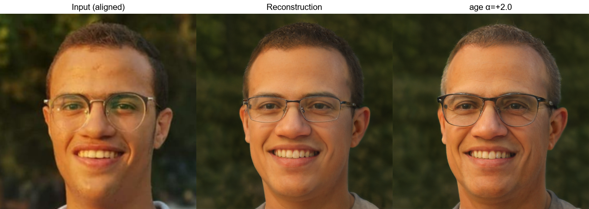
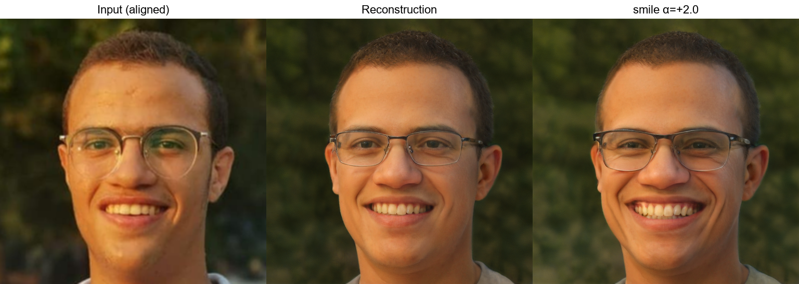
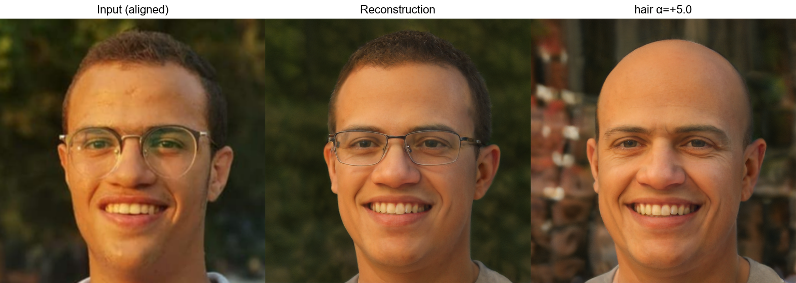
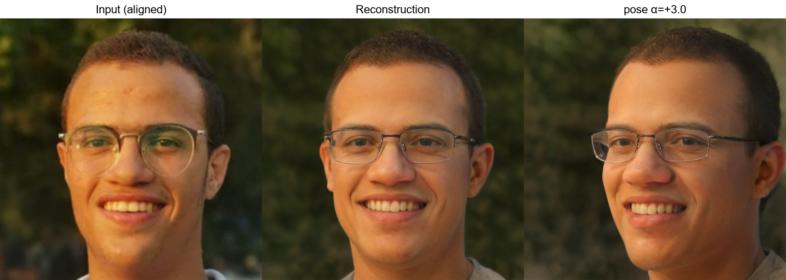

# Facial Attribute Manipulation using GAN Latent Space Editing

**Brief description**: This project implements a practical facial attribute manipulation system that edits semantic properties (age, facial expression, head pose, and hair) of a given input face image while aiming to preserve identity. The system combines **StyleGAN2** (FFHQ-pretrained) for high-fidelity face synthesis, **e4e** for GAN inversion into **W+**, and **InterfaceGAN** (plus an optional unsupervised SeFa direction for hair) for controllable latent edits.

**Author**: _Omar Ashraf Helmy_

---

## 1. Introduction

Generative models learn a data distribution \(p*{\text{data}}(x)\) and enable sampling of new, realistic instances \(x \sim p*{\theta}(x)\). In computer vision, they are used for synthesis, editing, restoration, super-resolution, and data augmentation. Among these models, **Generative Adversarial Networks (GANs)** have been particularly impactful because they can generate visually sharp, high-frequency details—critical for faces.

Facial attribute editing is valuable in:

- **Entertainment & creative tools**: portrait stylization, character design.
- **AR / digital media**: virtual try-on, avatar creation, post-production.
- **Human–computer interaction**: controllable expression or pose for telepresence.

### Problem definition

Given a real face image \(x\), modify a target attribute (e.g., smile intensity) **without changing identity**, i.e., preserve person-specific characteristics while altering only the desired semantic factor.

---

## 2. Background

### 2.1 Generative Adversarial Networks (GANs)

A GAN consists of:

- A **generator** \(G\) that maps a latent vector \(z \sim \mathcal{N}(0, I)\) to an image \(G(z)\).
- A **discriminator** \(D\) that predicts whether an image is real (from the dataset) or fake (from the generator).

Training is a minimax game:

$$\min_G \max_D V(G, D) = \mathbb{E}_{x \sim p_{data}}[\log D(x)] + \mathbb{E}_{z \sim p_z(z)}[\log(1 - D(G(z)))]$$

**Key challenges**:

- **Mode collapse**: the generator produces limited diversity.
- **Training instability**: adversarial objectives can be sensitive to hyperparameters.
- **Balance problem**: if \(D\) is too strong, gradients vanish; if too weak, \(G\) fails to learn.

Despite these issues, modern architectures and training strategies significantly improved stability and fidelity, making GANs practical for high-quality face synthesis and editing.

---

### 2.2 StyleGAN2

**StyleGAN2** is a style-based generator that decouples _where_ information is injected from _what_ is represented:

- A **mapping network** \(f\) transforms a simple latent \(z\) into an intermediate latent \(w\):  
  \[
  w = f(z)
  \]
- The synthesis network uses **style modulation** at each convolution layer, enabling semantic control at different scales:
  - **Coarse layers**: global structure (pose, face shape, hairstyle volume)
  - **Middle layers**: parts and layout
  - **Fine layers**: texture, color, micro-details

#### Latent spaces: \(Z\), \(W\), \(W^+\)

- **\(Z\)**: input noise space; entangled and less editable.
- **\(W\)**: intermediate space; more disentangled and better for edits.
- **\(W^+\)**: per-layer extension of \(W\):  
  \[
  w^+ = [w_1, w_2, \dots, w_L], \quad w_i \in \mathbb{R}^{512}
  \]
  For a 1024×1024 generator, \(L=18\). \(W^+\) increases reconstruction quality and local control but can reduce global consistency if edits are not layer-aware.

**Why StyleGAN2 here?** It offers strong prior for realistic faces and a latent structure where many semantic edits are approximately linear.

---

### 2.3 GAN Inversion

GANs generate images from latent codes, but **real images are not directly represented** in latent space. **GAN inversion** solves:

\[
\text{Given real image } x,\quad \text{find } w^+ \text{ such that } G(w^+) \approx x.
\]

#### Why inversion is needed

- To edit real photos (not just generated samples), we must map a photo into the generator’s latent space.

#### Inversion challenges

- Real images can be **out-of-distribution** w.r.t. training data.
- There is a trade-off between:
  - **Reconstruction quality** (pixel-level similarity)
  - **Editability** (staying on-manifold so edits remain realistic)

#### Chosen method: e4e (Encoder for Editing)

**e4e** is an encoder-based inversion method designed to preserve **editability**. Instead of optimizing \(w^+\) per image (slow), e4e trains an encoder \(E\) to predict latent codes:

\[
w^+ = E(x).
\]

In practice, e4e is typically trained to predict a **residual** around a mean latent \(\bar{w}\), producing stable and editable codes.

---

### 2.4 Latent Space Editing

The core idea is that some semantic attributes correspond to **approximately linear directions** \(d\) in latent space:

\[
w\_{\text{new}} = w + \alpha \, d
\]

where:

- \(w\): latent code (here \(W^+\))
- \(d\): direction vector for an attribute (e.g., smile)
- \(\alpha\): edit strength (positive/negative direction)

#### InterfaceGAN

**InterfaceGAN** learns linear boundaries in latent space using labeled data (e.g., “smile” vs “not smile”). The normal vector to the boundary becomes a direction \(d\). Moving along \(d\) changes the attribute while ideally preserving identity.

**Practical note**: some attributes are more disentangled than others; edits may introduce correlated changes (entanglement).

---

## 3. Methodology

### 3.1 End-to-end pipeline

**Input Image**  
→ **Preprocessing** (face alignment, resize, normalization)  
→ **GAN Inversion** via e4e encoder \(E\)  
→ **Latent Editing** by shifting in \(W^+\)  
→ **Synthesis** via StyleGAN2 generator \(G\)  
→ **Edited Image**

#### ASCII diagram

```
   x (real image)
        |
  [alignment + normalize]
        |
   x' (256x256)
        |
      E4E encoder E
        |
     w+ (18x512)
        |
   w+_edit = w+ + α d
        |
   StyleGAN2 generator G
        |
   y = G(w+_edit) (1024x1024)
```

---

### 3.2 Stage-by-stage explanation

#### A) Preprocessing (alignment + normalization)

The e4e encoder is trained on **FFHQ-aligned** faces. Misalignment (scale/rotation/crop) is a major source of identity drift. Therefore:

- Detect landmarks (preferred) and apply FFHQ-style similarity transform.
- Resize to 256×256 for the encoder.
- Normalize to \([-1, 1]\).

#### B) Inversion with e4e

The encoder maps the preprocessed image to a \(W^+\) code:

- \(w^+ = E(x')\)
- Optionally add a mean latent \(\bar{w}\) if the checkpoint predicts residuals.

#### C) Latent editing

Select attribute direction \(d\) and edit strength \(\alpha\):

- small \(|\alpha|\): subtle edits
- larger \(|\alpha|\): stronger edits, higher risk of artifacts/identity drift

Layer-selective editing can be applied:

- Hair: mainly **coarse layers** for structure (e.g., layers 0–6)
- Texture/color: often **middle/fine layers**

#### D) Synthesis with StyleGAN2

Generate the edited image with the fixed generator:

- \(y = G(w^+\_\text{edit})\)

---

## 4. Implementation Details

### 4.1 Framework and structure

- **Framework**: PyTorch
- **Core modules**:
  - `models/e4e_model.py`: wraps encoder + generator from the e4e checkpoint
  - `models/stylegan2/`: StyleGAN2 generator implementation
  - `models/encoders/psp_encoders.py`: e4e encoder architecture (Encoder4Editing)
  - `editing/latent_editor.py`: loads directions and applies latent edits
  - `utils/image_utils.py`: alignment + preprocessing utilities
  - `pipelines/editing_pipeline.py`: orchestrates end-to-end inversion + editing
  - `inference/edit_face.py`: CLI entry point

### 4.2 Pretrained assets

The system depends on externally downloaded weights:

- **e4e checkpoint**: `weights/e4e_ffhq_encode.pt`  
  Contains encoder weights, generator weights, and `latent_avg`.

- **Attribute directions**: stored under `weights/directions/`
  - `age.pt`, `smile.pt`, `pose.pt` (InterfaceGAN-like directions)
  - `hair.pt` (commonly derived via SeFa in this repo, but can be any valid direction)

### 4.3 Direction formats and broadcasting

Directions may be stored as:

- `(512,)` (single-vector direction)
- `(1, 512)` (batch-of-1)
- `(18, 512)` or `(1, 18, 512)` (per-layer \(W^+\) direction)

The editor normalizes these shapes and broadcasts to match `latent` shape `(B, 18, 512)` before applying:
\[
w^+\_\text{edit} = w^+ + \alpha \cdot \Delta
\]

### 4.4 Attribute handling and edit strength

| Attribute              | Direction source             | Typical behavior     | Notes                                                                |
| ---------------------- | ---------------------------- | -------------------- | -------------------------------------------------------------------- |
| **Age**                | InterfaceGAN                 | global change        | often affects skin texture + facial structure                        |
| **Smile / expression** | InterfaceGAN                 | localized change     | may affect cheeks/eyes                                               |
| **Pose**               | InterfaceGAN                 | structural change    | usually best handled in coarse layers; some directions are per-layer |
| **Hair style / color** | SeFa (default here) or other | structural + texture | hardest due to entanglement with age/pose; layer selection helps     |

The scalar \(\alpha\) controls edit intensity:

- \(\alpha > 0\): “increase” attribute (direction-dependent)
- \(\alpha < 0\): “decrease” attribute

---

## 5. Experiments

### 5.1 Experimental setup

- **Inputs**: a small set of portrait images placed in `data/input_images/`
- **Attributes tested**: age, smile, pose, hair
- **Strength sweep**:
  - Example range: \(\alpha \in \{-5, -3, -1, +1, +3, +5\}\)
  - Actual values can be configured per attribute (see experiment script defaults)

### 5.2 Procedure

For each input image:

1. Invert using e4e to obtain \(w^+\) and reconstruction \(G(w^+)\).
2. Apply one attribute direction at multiple \(\alpha\) values.
3. Save:
   - aligned input (encoder view)
   - reconstruction
   - edited output(s)
   - grid strips for qualitative evaluation

### 5.3 Output organization

Results are stored under:

- `results/<attribute>/...`
  - `<name>_input_preprocessed.png`
  - `<name>_reconstruction.png`
  - `<name>_<attribute>_<alpha>.png`
  - `<name>_<attribute>_<alpha>_grid.png`

---

## 6. Results (Qualitative)

### 6.1 Age Editing

**Observation**: Increasing \(\alpha\) adds age-related cues (wrinkles, facial proportions), while preserving global identity cues (eye region, facial structure) when inversion is accurate.



_Expected grid layout_: **Input (aligned) | Reconstruction | Edited**

---

### 6.2 Facial Expression Editing (Smile)

**Observation**: Smile directions typically produce consistent mouth curvature and cheek lift. Very large \(|\alpha|\) can over-exaggerate teeth/eyes, causing artifacts.



---

### 6.3 Hair Color / Style Editing

**Observation**: Hair is often the most entangled attribute. Changes may affect:

- hair volume/fringe placement (coarse)
- color/texture (fine)

Layer-restricted edits (coarse-only) often improve stability for hair shape edits.



---

### 6.4 Pose Editing

**Observation**: Pose edits can rotate head orientation while preserving identity. Strong edits may introduce background inconsistencies or distort ears/neck due to generator priors.



---

## 7. Qualitative Analysis

### 7.1 Realism

Because synthesis is performed by a high-quality StyleGAN2 generator trained on FFHQ, generated outputs generally remain photorealistic, particularly when latent codes remain on-manifold (a key advantage of e4e-style inversion).

### 7.2 Identity preservation

Identity preservation depends primarily on inversion quality:

- If alignment is correct and the face is in-distribution, reconstructions match well.
- Poor alignment or heavy occlusion can cause identity drift because the encoder must “project” the image onto the generator manifold.

### 7.3 Artifacts and failure modes

Typical artifacts include:

- **Over-editing** at large \(|\alpha|\): unnatural mouth/eyes, texture stretching.
- **Entanglement**: hair edits affecting age or vice versa.
- **Background leakage**: pose changes can modify background due to the generator’s learned correlations.

---

## 8. Discussion

### 8.1 Advantages of latent editing

- **Efficiency**: edit is a single vector addition in latent space.
- **Controllability**: \(\alpha\) gives a continuous knob over effect magnitude.
- **High visual fidelity**: edits are synthesized by a strong generator prior.

### 8.2 Limitations of linear directions

InterfaceGAN assumes approximate linear separability. In practice:

- Some attributes are **not purely linear** (complex hairstyles).
- Edits can be **entangled** with correlated factors (age ↔ hairline, pose ↔ lighting).

### 8.3 Why some attributes are harder

- **Smile**: localized and well-represented in FFHQ, often cleanly editable.
- **Pose**: structural, but still well-modeled by StyleGAN2; may change background.
- **Hair**: highly variable, interacts with pose, lighting, and background; harder to isolate as a single semantic factor.

---

## 9. Limitations

- **Dependency on pretrained priors**: If the input is far from FFHQ distribution (heavy makeup, extreme lighting, occlusion), inversion quality degrades.
- **Imperfect inversion**: Reconstruction is a projection onto generator manifold; exact pixel match is not guaranteed.
- **Limited disentanglement**: Linear edits can cause correlated attribute shifts.
- **Attribute direction quality**: The edit is only as good as the learned direction vector.

---

## 10. Conclusion

This project demonstrates an end-to-end, practical facial attribute editing system combining:

- **StyleGAN2** for high-resolution face synthesis,
- **e4e** for fast inversion into editable \(W^+\) latents,
- **InterfaceGAN-style directions** for semantic control.

The pipeline supports controllable editing of **age**, **expression**, **pose**, and **hair**, with a clear \(\alpha\) strength parameter. Results are qualitatively strong when preprocessing and inversion are accurate, while known limitations (entanglement, out-of-distribution inputs) remain areas for future improvement.

### Future improvements

- Use identity losses (e.g., ArcFace) during inversion refinement for stronger identity preservation.
- Add optimization-based refinement (PTI / latent optimization) as an optional step.
- Use non-linear edit methods or learned editors for difficult attributes like hair.
- Add quantitative metrics (ID similarity, LPIPS, FID on reconstructions).

---

## 11. References

1. **GANs**: I. Goodfellow et al., _Generative Adversarial Nets_, NeurIPS 2014.
2. **StyleGAN**: T. Karras et al., _A Style-Based Generator Architecture for GANs_, CVPR 2019.
3. **StyleGAN2**: T. Karras et al., _Analyzing and Improving the Image Quality of StyleGAN_, CVPR 2020.
4. **InterfaceGAN**: Y. Shen et al., _InterFaceGAN: Interpreting the Disentangled Face Representation Learned by GANs_, TPAMI 2020.
5. **e4e**: T. Tov et al., _Designing an Encoder for StyleGAN Image Manipulation_, SIGGRAPH 2021.
